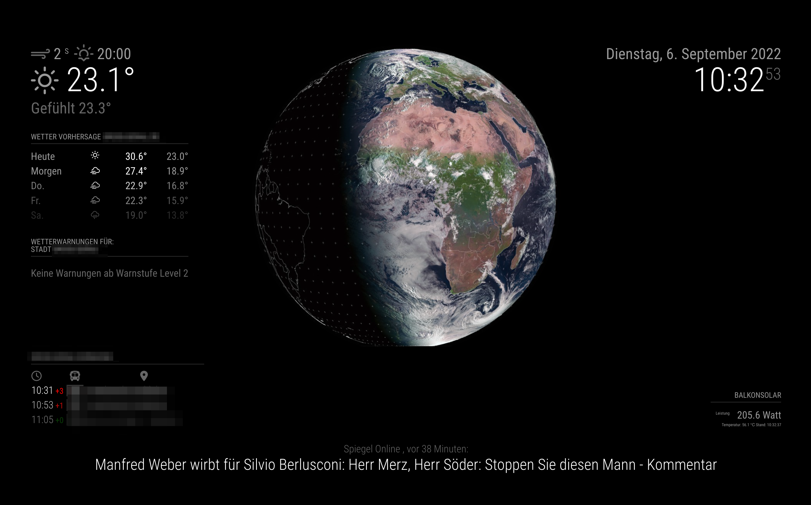

# MagicMirror

My self built and customized [MagicMirror](https://magicmirror.builders/), primarily configuration and widget list. Probably one or more customized modules.

**Note the empty space on the right? There is still a todo left**: I want to integrate our photovoltaics data and energy consumption, as soon as the construction work is done.

## Widget List

| Module | Description | Default |
| ------ | ----------- | -------: |
| Default modules |
| [Alert](https://docs.magicmirror.builders/modules/alert.html)  | Display notifications from other modules | yes |
| [Updatenotification](https://docs.magicmirror.builders/modules/updatenotification.html) | Display notification if new Magic Mirror software is released | yes |
| [Clock](https://docs.magicmirror.builders/modules/clock.html) | Display the current date and time | yes |
| [Current weather](https://docs.magicmirror.builders/modules/weather.html) | Display current and forecast weather | yes |
| [Forecast weather](https://docs.magicmirror.builders/modules/weather.html) | Display current and forecast weather | yes |
| [Newsfeed](https://docs.magicmirror.builders/modules/newsfeed.html) | Show newsfeed from rss | yes |
| Third party modules
| [Weather Warnings](https://github.com/LukeSkywalker92/MMM-DWD-WarnWeather) | Shows weather warnings from [Deutscher Wetterdienst](https://www.dwd.de/DE/Home/home_node.html) | [Github link](https://github.com/LukeSkywalker92/MMM-DWD-WarnWeather) |
| [Globe](https://github.com/LukeSkywalker92/MMM-Globe) | Display live images of earth from [Himawari-8 satelite](https://eumetview.eumetsat.int/static-images/latestImages.html) | [Github link](https://github.com/LukeSkywalker92/MMM-Globe) |
| [Public Transport Hafas](https://github.com/raywo/MMM-PublicTransportHafas) | Show informations regarding public transportation | [Github link](https://github.com/raywo/MMM-PublicTransportHafas) |
| Custom built modules |
| [Shelly PM](https://github.com/stefanjacobs/MMM-Shelly-PM) | Display power and temperature from shelly power meter | [Github link](https://github.com/stefanjacobs/MMM-Shelly-PM) |

## Appendix

### Currently used RSS Feeds

- [Spiegel Online](https://www.spiegel.de/schlagzeilen/tops/index.rss)
- [New York Times](https://www.nytimes.com/services/xml/rss/nyt/HomePage.xml)
- [Lebensmittelwarnungen in Hessen](https://www.lebensmittelwarnung.de/bvl-lmw-de/opensaga/feed/lebensmittel/hessen.rss)

### Helpful links

- [Installation](https://docs.magicmirror.builders/getting-started/installation.html)
- [Portrait Mode](https://forum.magicmirror.builders/topic/13059/portrait-mode/3)
- [Example Config](http://zirbitzkogel.at/blog/2019/06/09/magic-mirror-fuer-ikea-kallax-regal-selber-bauen/)
